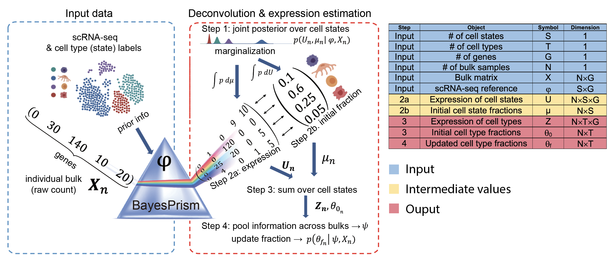

BayesPrism
========

Bayesian cell Proportion Reconstruction Inferred using Statistical Marginalization (BayesPrism): A Fully Bayesian Inference of Tumor Microenvironment composition and gene expression

BayesPrism consists of the deconvolution modules and the embedding learning module. The deconvolution module models a prior from cell type-specific expression profiles from scRNA-seq to jointly estimate the posterior distribution of cell type composition and cell type-specific gene expression from bulk RNA-seq expression of tumor (or non-tumor) samples. The embedding learning module uses Expectation-maximization (EM) to approximate the tumor expression using a linear combination of malignant gene programs while conditional on the inferred expression and fraction of non-malignant cells estimated by the deconvolution module. 


###  What's new?
* The new version v2.2 supports the input of sparse matrix (dgCMatrix) for scRNA-seq reference.
* The new version v2.1 improves the memory usage in snowfall by allocating only the necessary data to each node. 
* The new version v2.0 improves the memory efficiency and run-time. The new version is written in S4 objects. 
* Reports coefficient of variation (CV) for cell type fraction to quantify the uncertainties associated with the posterior distribution. 
* Contains utility functions for QC, plotting, outlier detection and extraction of results. 
* Past versions V1.x can be accessed at https://github.com/Danko-Lab/TED . 


1 Cloud Computing Service:
---------------

We provide a computational gateway to run BayesPrism on a HPC server. 

Please click the link to try this site:

https://www.bayesprism.org/


2 Cite BayesPrism:
-----------

Cell type and gene expression deconvolution with BayesPrism enables Bayesian integrative analysis across bulk and single-cell RNA sequencing in oncology

Chu, T. et al. & Danko, C.G.

https://www.nature.com/articles/s43018-022-00356-3

Contact me at: tc532@cornell.edu 


* Independent Benchmarks:
* Tran, K.A., Addala, V., Johnston, R.L. et al. Performance of tumour microenvironment deconvolution methods in breast cancer using single-cell simulated bulk mixtures. *Nat Commun* 14, 5758 (2023). https://doi.org/10.1038/s41467-023-41385-5
* Hippen, A.A., Omran, D.K., Weber, L.M. et al. Performance of computational algorithms to deconvolve heterogeneous bulk ovarian tumor tissue depends on experimental factors. *Genome Biol* 24, 239 (2023). https://doi.org/10.1186/s13059-023-03077-7
* Hu, M., Chikina, M. Heterogeneous pseudobulk simulation enables realistic benchmarking of cell-type deconvolution methods. *bioRxiv* 2023.01.05.522919; doi: https://doi.org/10.1101/2023.01.05.522919


3 Workflow of BayesPrism
--------



4 Installation
--------

* R packages:
	
	snowfall, NMF, gplots, scran, BiocParallel, Matrix

* If all dependent packages and commands have been installed, please use the following codes to install/update the package in R terminal. 

```````
library("devtools");
install_github("Danko-Lab/BayesPrism/BayesPrism")
```````


5 Usage
----------
library(BayesPrism)

See the vignette for details.

	
6 FAQ
----------------------------------------------------------------------
1) What if there are missing cell types?

BayesPrism assumes that the expression profiles for all cells are observed. As a result, we recommend the use of complete enumeration of cell types whenever possible. When the completeness assumption is violated, the fractions of each of the remaining cell types will become inflated. The extent of inflation is determined by the similarity in their expression to the missing cell type(s).

When information on subtypes of T cells, such as CD4+, CD8+, Treg, etc, are available, user should use the individual subtype as the reference (cell.type.labels) rather than a generic “T cell” by collapsing multiple subtypes. For more finer-grained cell states within each cell type, users can use the cell.state.labels argument to mark these states. 

2) How to label tumor reference?

Although BayesPrism does not assume the expression of malignant cells are completely observed in the scRNA-seq reference, its performance depends on the extent to which the reference of malignant cells represents those in bulk RNA-seq. To obtain the best possible representation for the unobserved expression of malignant cells in bulk RNA-seq, we recommend users to cluster the scRNA-seq data of malignant cells in individual patients, and then mark them using cell.state.labels. When malignant cells are from unmatched samples, users need to denote them by specifying the "key" argument in the new.prism function.

3) How many tumor samples are needed?

The number of patients needed for the reference mostly depends on the degree of heterogeneity of the tumor. In the deconvolution of GBM, we found a scRNA-seq reference containing ~ 4 patients generated by Yuan et al. was sufficient to achieve a good performance. We recommend users to determine the representativeness of the tumor cells by running the leave-one-out test, and then decide if the collection/curation for additional tumor samples are needed. 

4) What cell types are "dangerous" to include in the reference (only applicable to deconvolving tumors from unmatched samples)?

Users should be cautious when normal tissues of highly similar transcription profiles to the tumor cells are included in the reference, especially those represent the tumor cell origins. For example the inclusion of normal astrocyte to deconvolve GBM may cause the astrocytes to be overestimated and the malignant cells to be underestimated. Such an issue resulting from highly similar transcription profiles will mainly affect the inference of malignant cells, but not non-malignant cells (such as the inference of multiple subtypes of T cell), due to the under-representativeness of malignant cells in the reference caused by tumor heterogeneity. Note that this issue is not specific to BayesPrism. In fact, any regression approaches will suffer when one reference component does not sufficiently represent that in the mixture while additional components of similar expression profiles are also included in the reference. Nevertheless, most non-malignant cells, such as immune, endothelial, fibroblast and even oligodendrocytes in GBM do not show this issue across the three tumor types we tested. This issue can also be avoided by domain knowledge or running the leave-one-out test. Users can also subset the scRNA-seq reference on signature genes to ameliorate this issue.

5) How to clean up the scRNA-seq reference and bulk mixture? Are marker genes (signature genes) required?

Different RNA-seq platforms may contain systematic batch effects that cannot be corrected by BayesPrism. Loosely speaking, BayesPrism can correct batch effects for genes where the relative expression among cell types holds across platforms. Therefore, genes that are highly expressed in the mixture but are not detectable in the reference profile should be excluded. The new.prism function removes any genes in the mixture greater than 1% in more than 10% of the mixture samples by default. This threshold is very lenient, and usually not does not filter out a large number of genes.

We also highly recommend the exclusion of ribosomal and mitochondrial genes and genes on the sex chromosomes (if the sex are difference between reference and mixture) (now implemented by cleanup.genes function of the BayesPrism), as these genes are likely susceptible to batch effects. cleanup.genes function can also remove genes that have zero or low expression (expressed in less than # of cells) in scRNA-seq reference.

We found that subsetting on signature genes sometimes moderately improves the accuracy in inferring cell types when 1) batch effects are severe and 2) the scRNA-se reference contains cell types highly similar in transcription, i.e. only a small number of differentially expressed genes. For users' convenience, we implemented the function get.exp.stat/select.marker that performs differential expression test between cell states from different cell types (using the t-test provided by the findMarkers function from the scran package). Users should note that BayesPrism infers the fraction of reads over the given gene set. So when only signature genes are used, the fraction is interpreted as the fraction of reads of cell type X over those signature genes. 

6) Do I need to normalize the data or align them? 

NO. BayesPrism uses the raw count to generate the reference profile, and automatically normalizes each cell by its total count (MLE estimator). To avoid exact zeros in the reference profile. The package automatically adds a computed pseudo count to each cell type, such that after normalization the zero counted genes have the same value (default=10-8) across all cell types. Users may either provide a collapsed reference gene expression profile (input.type="GEP") from the scRNA-seq, or supply the raw count matrix of individual cells (input.type="count.matrix") when constructing the prism object using the new.prism function. Genes need not to be aligned between the reference matrix and the bulk matrix. new.prism will automatically collapse, align the genes on the common subset between reference and bulk, and then normalize the scRNA-seq reference. 

7) How many cells do I need to represent each cell state/type? 

Ideally users should keep the sequencing depth roughly the same across cell types, but in general, BayesPrism is robust to the variation in the sequencing depth, and maintains the relative ratio in inferred fractions even if an extremely shallowly sequenced cell type is used, such as the T cell in refGBM8. We recommend to have at least >20 cells to represent each cell state (see the tutorial_deconvolution.html for methods to perform QC).   

7 Interpreting the results of deconvolution
--------------------------------------------------
BayesPrism keeps both θ0, the initial estimates of cell type compositions, and θf, the updated estimates of cell type compositions in the output. In most cases, users should use the updated θ as it often improves over the initial estimates. Occasionally in some cases, the initial estimates θ0 shall be used. For example, if the mixture contains small amount of tumor fraction (<50%), or the reference and mixture do not have batch effects, e.g. reference profiles are obtained from the same bulk RNA-seq platforms by flow-sorting cells. 

8 Documents
----------

* R vignette:

* https://github.com/Danko-Lab/BayesPrism/blob/main/tutorial_deconvolution.html

* https://github.com/Danko-Lab/BayesPrism/blob/main/tutorial_embedding_learning.html 

To view, please git clone the repository and open the html files using your browser. 
